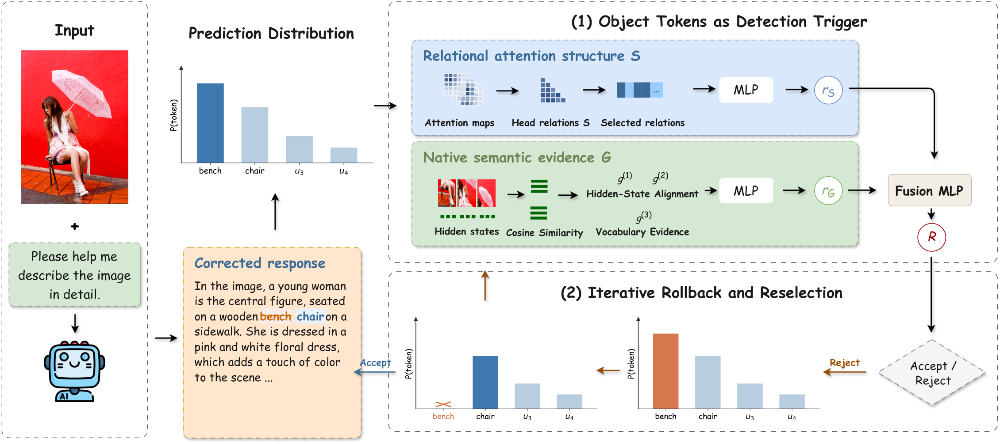

# RASE

**Looking Is Not Grounding: Rethinking Attention-Based Hallucination Detection and Mitigation in LVLMs**

RASE combines relational attention structure and native semantic evidence to detect object hallucinations in large vision-language models. During generation, the detector scores each recognized object mention and guides rollback and reselection from the model's original prediction distribution.



## Method

For the forward pass that consumes the first subtoken of an object mention, RASE collects attention and hidden states across decoder layers.

- **Relational attention structure (S).** Each head's attention is normalized over all native visual tokens. Pairwise Bhattacharyya similarities describe the relations between heads. The bottom 1% of head pairs by mean similarity on grounded training mentions forms the structural feature vector. An MLP with widths `K → 128 → 32 → 1` produces the structural risk `r_S`.
- **Native semantic evidence (G).** Each layer contributes three features: the mean of the top 5% token–visual cosine similarities; attention-weighted cosine similarity minus the visual-token mean; and the mean target-token probability over those same cosine-selected visual positions. A semantic MLP maps the resulting `3L` features to `r_G`.
- **Risk fusion.** A single linear layer followed by a sigmoid combines `[r_S, r_G]` into the hallucination risk.
- **Rollback and reselection.** A rejected object restores generation to its first subtoken. Rejected token IDs accumulate in a ban set associated with the complete prefix. Decoding selects the next available token from the saved original distribution and evaluates replacement objects in turn.

## Installation

Use Python 3.10 or newer. From the repository root:

```bash
pip install -e '.[vlm,test]'
python -m spacy download en_core_web_sm
```

The model adapters use Transformers 4.57.6. Download the corresponding backbone into a local directory and pass it through `--model`.

## Pretrained S MLPs

The release includes four structural detectors trained on COCO training images. Each checkpoint contains the MLP parameters, selected head-pair indices, and feature normalization statistics.

| Backbone | Checkpoint | Selected S pairs | G dimensions |
|---|---|---:|---:|
| LLaVA-1.5-7B | [llava15_7b](checkpoints/llava15_7b/s_mlp.pt) | 5,238 | 96 |
| LLaVA-v1.6-Mistral-7B | [llava16_7b](checkpoints/llava16_7b/s_mlp.pt) | 5,238 | 96 |
| Qwen2.5-VL-7B | [qwen25_7b](checkpoints/qwen25_7b/s_mlp.pt) | 3,070 | 84 |
| Qwen3-VL-8B | [qwen3_8b](checkpoints/qwen3_8b/s_mlp.pt) | 6,630 | 108 |

The [checkpoint manifest](checkpoints/manifest.json) records backbone identifiers, dimensions, file sizes, and SHA-256 hashes. The published weights are the **S branch**. The training command below produces the semantic branch and fusion parameters for full RASE inference.

```bash
rase verify-checkpoints
```

Score a tensor of visual attention for a consumed object subtoken:

```python
import torch
from rase import StructuralDetector

model = StructuralDetector('checkpoints/llava15_7b/s_mlp.pt')
# attention: [decoder_layers * heads_per_layer, native_visual_tokens]
# Heads are ordered by decoder layer, then by head within each layer.
attention = torch.load('data/object_attention.pt', weights_only=True)
risk = model.score_attention(attention)
print(risk.item())
```

To score already selected S features, supply a `.npy` array with shape `[mentions, selected_pairs]`. Its columns follow `selected_edge_indices` in the checkpoint:

```bash
rase score-s --checkpoint checkpoints/llava15_7b/s_mlp.pt \
  --features data/selected_s.npy
```

Scores represent hallucination risk: `0` is grounded and `1` is hallucinated.

## Training

Training uses image-level folds, grounded-reference S selection, fitting-split standardization, and weighted binary cross-entropy. The S MLP uses 7 epochs, batch size 512, AdamW learning rate and weight decay of 0.001, dropout 0.1, and gradient clipping at 5. The semantic MLP has widths `3L → 32 → 1`; its default training length is 7 epochs. The two-risk fusion layer uses 30 epochs. Epoch counts are configurable through the training command.

Five-fold cross-fitting supplies branch scores for fusion training. Each outer fold is excluded from structural selection, normalization, branch training, and fusion training. The operating threshold maximizes hallucination F1 among training out-of-fold points with recall at least 0.90. Final S and G branches fit all training images; final fusion fits cross-fitted branch scores.

### Extract object features

Prepare a JSONL file with one record per image. `generated_ids` contains the backbone's caption token IDs. Each mention supplies the zero-based index of its first subtoken and its object-presence label:

```json
{"image_id": 1, "image": "data/image.jpg", "prompt": "Describe this image in detail.", "generated_ids": [123, 456, 789], "mentions": [{"token_index": 1, "label": 0}]}
```

Use the token IDs from your own generated caption and labels from the dataset annotations. `label=0` denotes a grounded mention and `label=1` a hallucinated mention. The extraction prompt must match the prompt used to generate those token IDs.

```bash
rase extract --model models/llava-1.5-7b-hf \
  --records data/train_mentions.jsonl --output outputs/train_features.npz
```

The output contains `s` (all strict-upper head-pair similarities), `g` (three semantic features per layer), `labels`, and `image_ids`. Full S extraction is intended for training; deployed scoring computes only the selected pairs. Memory scales with the number of training mentions and head pairs.

```bash
rase train --features outputs/train_features.npz \
  --backbone-model-type llava --device cuda:0 --output outputs/llava15
```

The output directory contains `s_mlp.pt`, `semantic_fusion.pt`, `oof_scores.npz`, and `training.json`. Supported backbone types are `llava`, `llava_next`, `qwen2_5_vl`, and `qwen3_vl`.

## Captioning with rollback

Use the S and semantic/fusion checkpoints produced by the same training run:

```bash
rase caption --model models/llava-1.5-7b-hf --image data/image.jpg \
  --checkpoint outputs/llava15/s_mlp.pt \
  --semantic-checkpoint outputs/llava15/semantic_fusion.pt
```

The command uses greedy decoding and the stored training threshold. For S-only decoding, pass one of the released S checkpoints and set `--threshold` to an operating point calibrated on S training scores.

`configs/objects.json` provides the 80 COCO category names for candidate recognition. A vocabulary file can add category aliases and benchmark-specific object phrases using the same schema. `--vocabulary` and `--vocabulary-key` select this configuration. Every recognized occurrence is evaluated, including repeated mentions and objects beginning at the first generated token.

## Video extension

The Qwen2.5-VL adapter supports native video tokens and the same rollback procedure. Install the video dependencies with `pip install -e '.[vlm,video]'`.

A video record contains `clip_id`, `source_video_id`, `video_path`, `source_fps`, `source_frame_count`, and `sampled_frame_indices`. Use `rase.video.frame_indices(start, end, 16)` to sample 16 frames uniformly from a clip. Add `generated_ids` and `mentions` for training records, as in the image format above.

```bash
rase extract --video --model models/Qwen2.5-VL-7B-Instruct \
  --records data/video_mentions.jsonl --output outputs/video_features.npz
rase train --features outputs/video_features.npz \
  --backbone-model-type qwen2_5_vl --device cuda:0 --output outputs/video
rase caption --model models/Qwen2.5-VL-7B-Instruct \
  --video-record data/clip.json --checkpoint outputs/video/s_mlp.pt \
  --semantic-checkpoint outputs/video/semantic_fusion.pt
```

Video training groups clips by source video when constructing folds. The paper's video setting trains on VidOR and evaluates object-level hallucination on Vript-HAL.

## Evaluation and tests

The paper evaluates object-level detection on COCO and image-captioning mitigation on COCO, AMBER-G, and NoCaps. Detection scores support AUROC, accuracy, precision, recall, and F1. Caption-level evaluation uses CHAIR and object coverage for COCO/NoCaps, and CHAIR, Hal, Cover, and Cog for AMBER-G.

```bash
pytest -q
```

Tests cover the paper's feature formulas, head-pair selection, checkpoint integrity, image folds, training and fusion inference, native video layout, candidate boundaries, and prefix-specific cache restoration.

## Source layout

| File | Purpose |
|---|---|
| `src/rase/s_relations.py` | Bhattacharyya head-pair similarities |
| `src/rase/features.py` | Semantic evidence |
| `src/rase/detector.py` | S scoring, semantic MLP, and risk fusion |
| `src/rase/training.py` | Image-level cross-fitting and threshold calibration |
| `src/rase/pipeline.py` | First-subtoken evidence collection |
| `src/rase/online_s_rollback.py` | Online rollback and token reselection |
| `src/rase/model_adapter.py` | Four image-model adapters |
| `src/rase/video.py` | Native Qwen2.5-VL video adapter |
| `src/rase/cli.py` | Extraction, training, scoring, and captioning commands |
